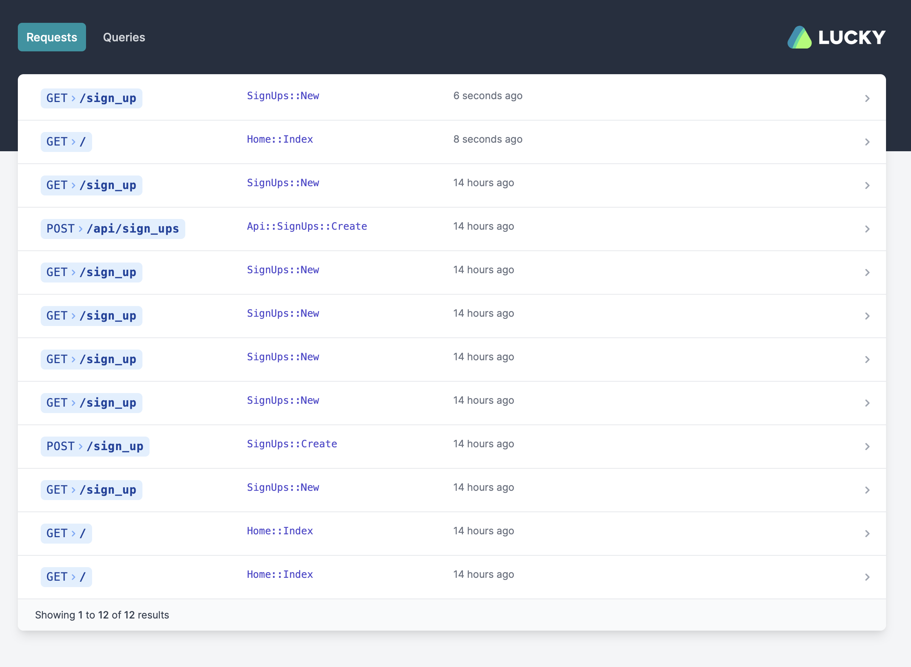

> Crystal 1.0.0 is out! 🥳 And Lucky 0.27.0 is fully compatible with it.

<!-- truncate -->

We want to first congratulate the Crystal team for their long awaited release of
1.0! 🎉 This is a huge milestone for not only the language, but the whole community.
[Read the release post here](https://crystal-lang.org/2021/03/22/crystal-1.0-what-to-expect.html).

We're sure the next question on your mind is "When will Lucky hit 1.0?". Don't fret!
We're working towards that, and with each release we get closer and closer.
To set some expectation, the actual answer is "When it's ready", but to give a little direction,
the next release (or two) for sure won't be 1.0 for us. We want to ensure we have a solid 1.0 release,
and we feel it's better to take our time, and do it right 💪.

[Lucky v0.27](https://github.com/luckyframework/lucky/blob/main/CHANGELOG.md)
is officially out. It's a smaller release, but brings some pretty big steps. We hope
you're as stoked about the progress as we are!

### How to upgrade

See the [UPGRADE_NOTES](https://github.com/luckyframework/lucky/blob/main/UPGRADE_NOTES.md#upgrading-from-025-to-026).

Or you can view the changes using [LuckyDiff](https://luckydiff.com/?from=0.26.0&to=0.27.0).
This tool helps see what has changed between versions and will be included in upgrade notes from now on.

## Here's what's new

### Crystal 1.0 Support

For the most part, Crystal 1.0 worked with Lucky 0.26 with the exception of cookies.
For the Crystal 1.0 release, there were a few changes around cookies:

- [remove implicit path `/`](https://github.com/crystal-lang/crystal/pull/10491)
- [remove implicit en-/decoding of cookie values](https://github.com/crystal-lang/crystal/pull/10485)
- [remove cookie name decoding](https://github.com/crystal-lang/crystal/pull/10442)
- [split from_headers in to separate methods](https://github.com/crystal-lang/crystal/pull/10486)

These changes mean that, with Crystal 1.0, cookie values that contain certain characters like
`\\n`, `"`, `;`, and a few others, are no longer valid.

Prior to Lucky 0.27, Lucky session cookies were encoded using `Base64.encode` (which adds a newline character).
This was [patched](https://github.com/luckyframework/lucky/pull/1467) in Lucky 0.27.1.

### Introduction of Breeze

[Breeze](https://github.com/luckyframework/breeze) is a new development dashboard system
for Lucky apps. It allows you to get a higher overview of each request you make in your app.
See which queries ran for a specific request, as well as which pipes, cookies, sessions, and headers
all interacted for that request.

Breeze also allows you to create your own extensions. It comes with a built-in extension for viewing
[Carbon Email](https://github.com/luckyframework/carbon) previews. This makes designing your emails
a lot easier, and all right in your browser.

We are still working on Breeze, but feel free to watch the repo, and even give it a shot in your app.
Let us know what you think!

### LuckyTask

This was originally called `LuckyCli::Task` which existed in the [lucky_cli](https://github.com/luckyframework/lucky_cli) shard.
LuckyCli was required in any shard that included custom tasks. (e.g. Avram, Lucky, Breeze, etc...)

By abstracting this out to a separate shard, we gain about ~17% (or more) speed in compilation
time. This is mainly on cold cache, but it means your apps won't sit in the CI as long as they were!

Who doesn't love a little speed up? 😄

### And more

The bulk of the updates have been mostly internal. Removing deprecated methods,
code organization, fixing some bugs, and making some compile-time errors a bit
more user friendly.

## Parting words

As more people use Lucky, we are able to solidify what a Lucky 1.0 will look like.
The goal will be with the release of 1.0, we won't need major breaking changes to
how the framework functions.

If you haven't had a chance to try building an app, now's the perfect time to do so!

Thank you so much for the support!

### Follow and spread the word

If you haven't already, give us a [star on GitHub](https://github.com/luckyframework/lucky),
and be sure to follow us on [Twitter](https://twitter.com/luckyframework/).

Learn tips and tricks with [LuckyCasts](https://luckycasts.com/).

For questions, or just to chat, come say hi on [Discord](https://www.luckyframework.org/chat).
